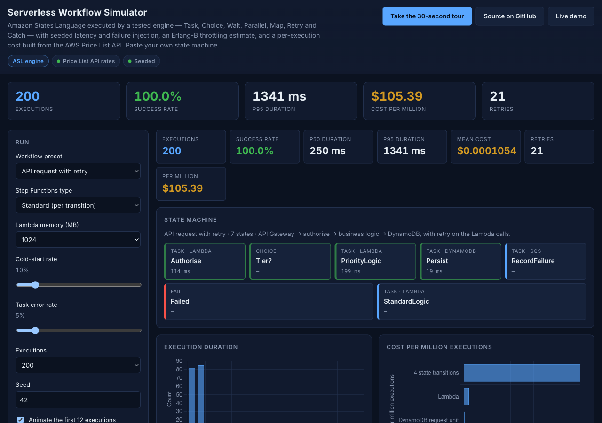
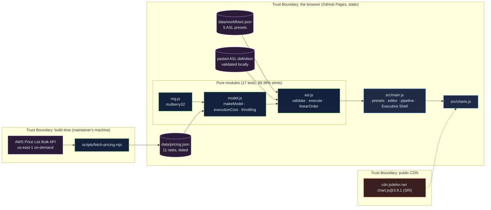

# Serverless Workflow Simulator: an Amazon States Language engine in the browser, with costs from the price list

[](https://github.com/Freddricklogan/serverless-workflow-simulator/actions/workflows/deploy.yml)
[](#5-getting-started--verification)
[](https://github.com/Freddricklogan/serverless-workflow-simulator/actions/workflows/codeql.yml)
[](LICENSE)
[](https://freddricklogan.github.io/serverless-workflow-simulator/)

## 1. Executive Summary & Business Impact

**Problem statement.** Serverless cost and latency questions are usually
answered with a diagram of boxes and a rate someone remembers. The
previous version of this page did exactly that: five flat lists of
boxes, `Math.random` sleeps, two hard-coded Lambda prices billed against
the whole pipeline's duration (so API Gateway and DynamoDB time was
charged as Lambda compute), a memory slider that sped up DynamoDB, and a
"concurrency bar" that could never throttle (`AUDIT.md`).

**Solution & value delivered.** A state-machine engine that executes
Amazon States Language — Task, Choice, Wait, Parallel, Map with
MaxConcurrency, Pass, Succeed, Fail, Retry with BackoffRate, Catch with
ResultPath — against a seeded latency and failure model, and prices each
execution line by line from rates pulled from the AWS Price List Bulk API
(us-east-1, fetched 2026-09-21, the date printed on the page). Five
presets ship as real ASL documents; paste your own and the validator
names every problem before it runs. An Erlang-B panel turns arrival rate,
median duration and reserved concurrency into a throttling probability.

**[→ Read the full case study](docs/CASE_STUDY.md)**



## 2. Demonstrated Competencies & Technical Skills

- **Cloud & Serverless Architecture** — Amazon States Language semantics
  (Retry intervals and backoff, Catch with ResultPath, Parallel and Map
  timing under a concurrency limit), Standard versus Express billing,
  Lambda GB-second arithmetic, DynamoDB request units.
- **Data Science & Modelling** — seeded Mulberry32 stream, per-invocation
  cold-start and error draws, p50/p95 with interpolation, Erlang-B
  blocking probability and occupancy.
- **Security & Compliance** — strict CSP, SRI on the one CDN script with
  a vendored fallback, no `innerHTML`, pasted definitions treated as
  untrusted text; CodeQL and Trivy in CI.
- **Engineering Practice** — pure modules with 99.38 % statement
  coverage including failure paths for Parallel, Map, Retry and Catch;
  pricing fetched by a script into a dated data file rather than typed
  into the code.

## 3. System Architecture & Data Flow



No backend, no account, no telemetry. The browser never calls AWS; the
rates are a committed file with a fetch date.

## 4. Technical Highlights & Engineering Decisions

### ADR-1 — Execute the language, do not animate a list

**Context.** The old page's "Step Functions" templates were arrays walked
in order; nothing could branch, retry, wait or fan out.

**Decision.** Presets are Amazon States Language documents. `execute()`
implements the state types a working definition needs, including the
Retry timing rule (IntervalSeconds × BackoffRate^attempt), Catch with
ResultPath, Parallel elapsed time as the slowest branch and Map elapsed
time as waves of MaxConcurrency items. A 1000-state loop guard stops a
definition that never ends.

**Consequence.** `tests/asl.test.js` asserts exact traces and elapsed
milliseconds for retry-then-catch, Parallel and Map failure, Choice
rules and Wait — behaviour a reader can check against the AWS
documentation rather than take on trust.

### ADR-2 — Prices come from a script, with a date, per service

**Context.** Two hard-coded Lambda numbers priced everything, including
services that are not Lambda.

**Decision.** `scripts/fetch-pricing.mjs` reads the Price List Bulk API
offer files for Lambda, Step Functions, SQS, SNS, API Gateway and
DynamoDB and writes the first on-demand tier for us-east-1 to
`data/pricing.json`. `executionCost()` bills each Task by the service in
its ARN, each Lambda attempt as its own request and GB-seconds, and adds
state transitions (Standard) or requests plus duration (Express).

**Consequence.** The page shows the source and fetch date beside the
table, switching Standard to Express changes the lines, and the rates can
be refreshed by re-running the script — not by editing code.

### ADR-3 — Throttling by Erlang-B, not by a bar

**Context.** The old concurrency bar could never show a throttle because
executions ran one at a time.

**Decision.** `throttling(arrivalsPerSecond, medianMs, concurrency)`
computes offered load in Erlangs and the Erlang-B blocking probability
from the recursive formula, tested against the closed form for a single
server.

**Consequence.** The panel states its assumption (Poisson arrivals,
the median duration as service time) and updates as you change the
inputs, and the number it prints has a name a reader can look up.

## 5. Getting Started & Verification

**Prerequisites.** Node 22 LTS. No build step; the page is served from the
repository root.

```bash
git clone https://github.com/Freddricklogan/serverless-workflow-simulator.git
cd serverless-workflow-simulator
npm ci
npm run lint && npm run validate && npm run coverage
npx serve .    # open http://localhost:3000
node scripts/fetch-pricing.mjs   # optional: refresh data/pricing.json from the Price List API
```

**Verification — the numbers this repository actually produced:**

```bash
npm run coverage   # 17 passed / 17; All files 99.38% stmts, 90.95% branches
npm run lint       # 0 problems
npm run validate   # html-validate index.html: clean
```

| Check | Result |
| --- | --- |
| Unit tests (Vitest) | **17 passed / 17** across 3 files |
| Coverage (pure modules) | **99.38%** statements, **90.95%** branches (`main.js`, `ui.js`, `charts.js` covered by the browser smoke test) |
| ESLint, html-validate | clean |
| Pricing data | 11 rates from the AWS Price List Bulk API, us-east-1, fetched 2026-09-21 |
| Headless Chrome smoke | **0 console errors**; API preset seed 42 × 200 executions: 100.0 % succeeded, p50 250 ms, p95 1341 ms, 21 retries, mean $0.0001054 per execution; Map preset p50 824 ms; invalid definition reported as `state "X": needs Next or End`; four tour steps; no horizontal scroll at 1280 or 400 px |

## 6. Live Demo & Production Showcase

**<https://freddricklogan.github.io/serverless-workflow-simulator/>**

**30-second guided walkthrough.** Press **Take the 30-second tour**: it
runs the API preset with the pipeline animated, switches the cost table
to Express, raises the arrival rate until the Erlang-B panel shows real
throttling, then loads and runs the Map preset. Paste any Amazon States
Language definition into the editor to run your own.
